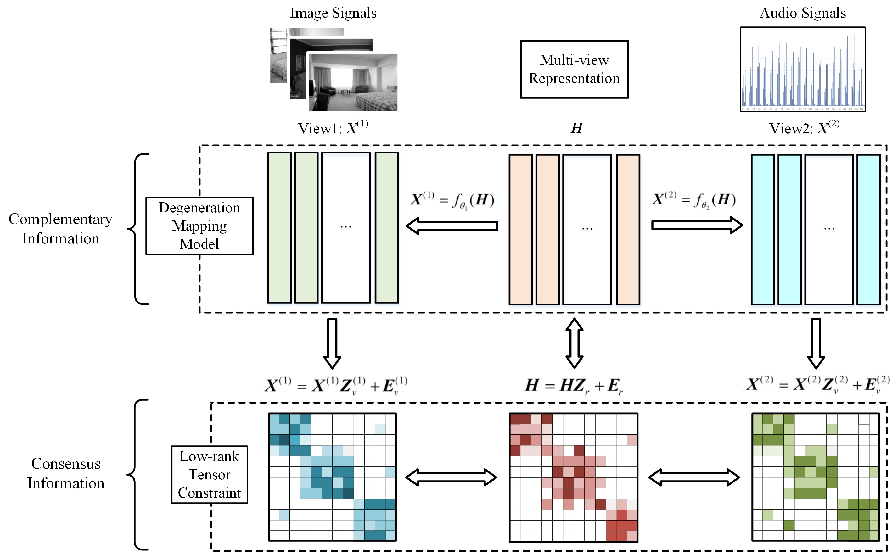

# CMRL
Source codes of the work "Comprehensive multi-view representation learning" published in Information Fusion 2022.

The demo files (including corresponding datasets )of BBC-Sport and NGs are included in this repository.

If you find this repository useful in your research, please cite our work as follows, thanks.

@article\{CMRL, 
      &nbsp;&nbsp;&nbsp;&nbsp;title=\{Comprehensive multi-view representation learning\}, 
      &nbsp;&nbsp;&nbsp;&nbsp;author=\{Zheng, Qinghai and Zhu, Jihua and Li, Zhongyu and Tian, Zhiqiang and Li, Chen\}, 
      &nbsp;&nbsp;&nbsp;&nbsp;journal=\{Information Fusion\}, 
      &nbsp;&nbsp;&nbsp;&nbsp;volume=\{89\}, 
      &nbsp;&nbsp;&nbsp;&nbsp;pages=\{198-209\}, 
      &nbsp;&nbsp;&nbsp;&nbsp;year=\{2023\}, 
      &nbsp;&nbsp;&nbsp;&nbsp;publisher=\{Elsevier\} 
\} 

Email: qhxjtu@163.com

